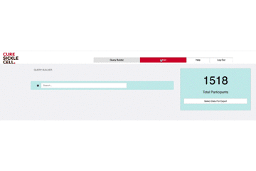
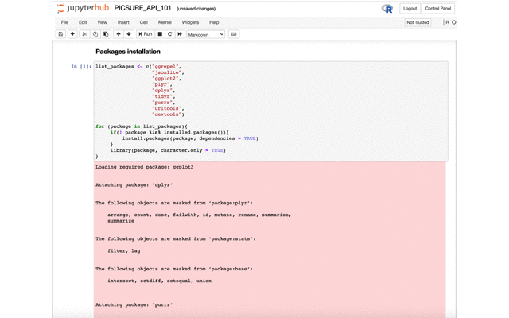

# Cure Sickle Cell
The Cure Sickle Cell Initiative (CureSCi) aims to transform the lives of people who have sickle cell disease by creating a collaborative, patient-focused research environment. With new advancements in genetic therapy, the time is right to push toward cures that are more accessible to the approximately 100,000 Americans, and more than 20 million people worldwide, who have sickle cell disease.

https://curesickle.org

Access to data: https://curesc.hms.harvard.edu

# Grant information
The Cure Sickle Cell Initiative (CureSCi) was established in 2018 by the National Heart, Lung, and Blood Institute to accelerate the development of treatments aimed at a genetic-based cure for sickle cell disease (SCD).

# PIC-SURE API Cure Sickle Cell examples

This folder contains various PIC-SURE API use-cases and illustration examples using Cure Sickle Cell studies. PIC-SURE API is available in two languages --R and python. PIC-SURE API requires R 3.5 or later, or python 3.6 or later.

## PIC-SURE API Overview

The main goal of the PIC-SURE API is to provide a simple and reliable way to work with restricted-access data studies that are part of CureSC. Each individual study is accessible in a unique, easy to use, tabular format directly in an R or python environment. The API allows also to query studies subset, based on patients matching specified criteria, as well as to retrieve a cohort that has been created using the [PIC-SURE interface](https://curesc.hms.harvard.edu). 

## Setting up your environment
Prior to exploring the data you will need to set up your local JupyterNotebook. 
1. In a web browser, open the PIC-SURE UI login page: https://curesc.hms.harvard.edu, and login with the authentication provider you have been assigned.
2. On the user-interface click on ADMIN
3. On the user-interface click on APPLICATIONS, in the dropdown select JupyterHub. This is your own local instance of JupyterHub. 
4. On the user-interface click on NEW, in the dropdown select Terminal.  A new tab will open in the browser. Copy and paste the below:
git clone https://github.com/hms-dbmi/Access-to-Data-using-PIC-SURE-API 
5. Click enter and close the window. 
6. Access-to-Data-using-PIC-SURE-API folder has been created. Click the folder to open it. Click the Cure_Sickle_Cell folder.
7. Choose Python or R folder.

Follow the directions below to add your security token. 

## Get your security token

**In order to be able to run any one of these examples, you'll need to get a personal user security token**. This is the way the API grants access to individual users to protected-access data. **The user token is strictly personal, be careful not to share it with anyone**.

To get your token, follow the process below:
1. In a web browser, open the PIC-SURE UI login page: https://curesc.hms.harvard.edu, and login with the authentication provider you have been assigned.
2. On the user-interface click on ADMIN
3. On the user-interface click on USER PROFILE
4. On the pop-up window, click on REFRESH and then COPY
5. On the user-interface click APPLICATIONS, in the dropdown select JupyterHub.
6. In your Jupyter environment, click the Access-to-Data-using-PIC-SURE-API folder. Then click the Cure_Sickle_Cell folder.
7. Select R and/or Python folder. In this example we are selecting R. 
8. In the right hand corner click NEW, in the dropdown select Text File. A new tab will open in the browser.
9. Paste your security token into the text file. In the left hand corner click File and in the dropdown select Rename. In the pop-up window name the file `token.txt`. Click the blue OK button. Click File and in the dropdown select Save. Then close the tab. 

## Available notebooks

In each R and python folders, the example notebooks are available: 
- PICSURE-API_101.ipynb: an illustration of the main functionalities of the PIC-SURE API.

**R Installation**
1. In the R folder click the PICSURE-API_101.ipynb folder. There is an overview about the R API and a reminder to set up your security token. Direction are above to retrieve your security token. 
2. To install R, scroll down to Packages Installation. Click on the grey code box which will place a green square around the code. Click the Run button in the toolbar. A pink box will appear showing the details of the installation. 
3. Scroll down to Installing latest R PIC-SURE API libraries from github. Click on the code box and click the Run button in the toolbar. 
4. Scroll down to Loading user defined functions. Click on the code box and click the Run button in the toolbar. 
5. Scroll down to Connecting to a PIC-SURE Network. The next steps gain access to your security token. Direction are above to retrieve your security token. Click one code box at a time and click the Run button in the toolbar. 
You are now ready to start exploring the variables dictionary. 

## Contact

For bug report or additional information, please submit a ticket to: http://avillachlabsupport.hms.harvard.edu 
